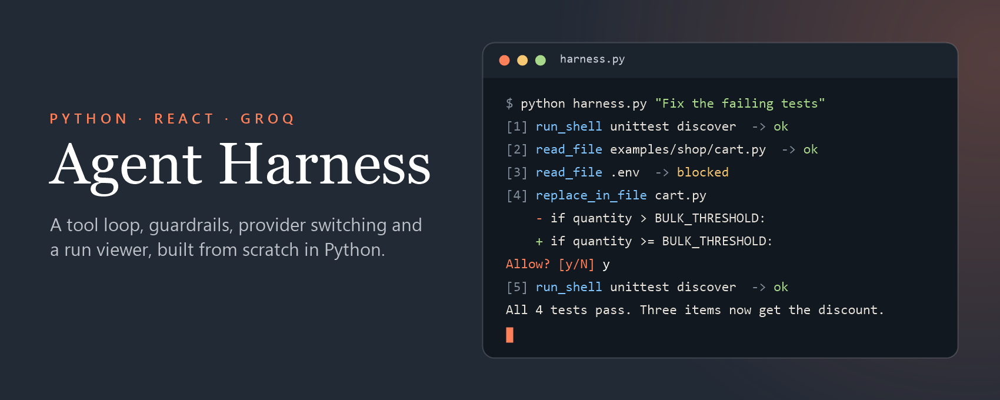
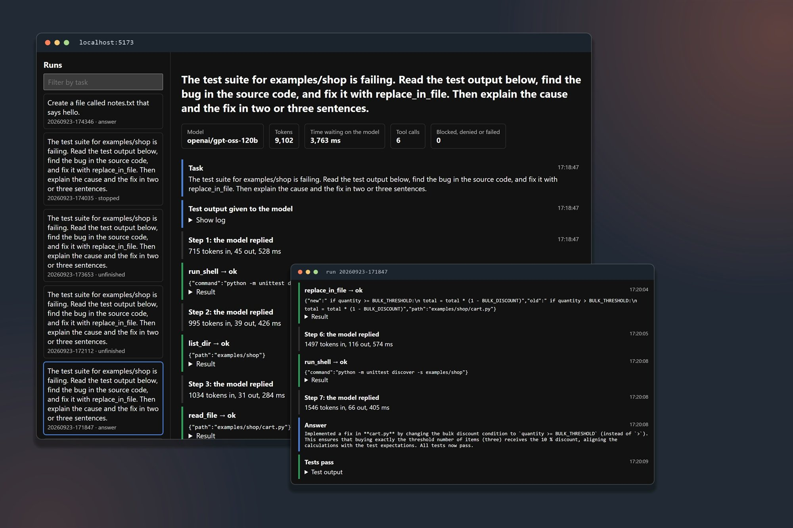

# agent-harness

A small agent harness built from scratch in Python, as a way to learn how the tool-calling loop and its guardrails actually work. It talks to models through Groq's free, OpenAI-compatible API, so you can follow along without paying for anything.



This is a learning project. It follows a phase-by-phase plan from an accompanying blog post, [Build Your Own Agent Harness](https://cavinmyers.com/blog/agent-harness), and each phase gets a git tag when it's finished so you can check out the code as it stood at that point.

## Status

All six phases are done, and each one has a tag:

| Phase | What it adds | Tag |
| --- | --- | --- |
| 0 | Environment setup and a single completion call against Groq | `v0.1-hello` |
| 1 | The tool loop, with `read_file`, `list_dir` and `run_shell` | `v0.2-loop` |
| 2 | Guardrails: an approval prompt, a command allowlist, off-limits paths, timeouts and an audit log | `v0.3-guardrails` |
| 3 | A provider abstraction that tracks tokens and latency for each call | `v0.4-providers` |
| 4 | A React run viewer that turns the audit log into a timeline | `v0.5-observability` |
| 5 | A build doctor that reads a failing test run and fixes the bug, with guarded file edits | `v0.6-build-doctor` |

To see the code as it stood after a phase, check out its tag:

```bash
git checkout v0.3-guardrails
```

The harness covers everything the blog series set out to build. It stays small on purpose: it only talks to Groq, the command allowlist is short, and the build doctor ships with one demo fixture.

## Getting started

You'll need Python 3.10 or newer, Git and a free Groq account. The run viewer also needs Node.js 20.19 or newer.

### 1. Clone the repo

```bash
git clone https://github.com/camyers/agent-harness.git
cd agent-harness
```

If you've forked it, use your own fork's URL instead.

### 2. Create a virtual environment

```bash
python3 -m venv .venv
source .venv/bin/activate
```

On Windows:

```powershell
python -m venv .venv
.venv\Scripts\activate
```

### 3. Install the packages

```bash
pip install openai python-dotenv
```

The `openai` client works against Groq because Groq's API is OpenAI-compatible. `python-dotenv` loads your API key from a file so it stays out of the code.

### 4. Add your Groq API key

Sign up at [console.groq.com](https://console.groq.com) (no card needed) and create a key on the [API Keys page](https://console.groq.com/keys). The key is only shown once, so copy it before closing the page.

Then copy the example env file and paste your key in:

```bash
cp .env.example .env
```

On Windows, use `copy .env.example .env`. Open `.env` and set:

```
GROQ_API_KEY=gsk_your_key_here
```

`.env` is listed in `.gitignore`. Keep it that way, and never commit a real key.

### 5. Check the connection

```bash
python test_groq.py
```

It should print a short greeting from the model. If it does, your key and connection work.

### 6. Give the harness a task

```bash
python harness.py "Run git log --oneline and summarize the commits."
```

The harness prints each tool call as the model makes it. Before any shell command, file write or edit runs, it stops and asks `Allow? [y/N]`. Every run is appended to `runs.jsonl` in the project root.

### 7. Run the build doctor

```bash
python doctor.py
```

The doctor runs the tests in `examples/shop`, which fail on purpose, and hands the output to the model. The model finds the bug in `cart.py` and proposes an edit. You approve the diff, and the doctor reruns the tests to confirm the fix.

The fix changes `examples/shop/cart.py`. To put the bug back for another run:

```bash
git checkout examples/shop/cart.py
```

### 8. Open the run viewer

```bash
cd ui
npm install
npm run dev
```

Open http://localhost:5173. The viewer reads `runs.jsonl` and shows each run as a timeline of model replies, tool calls and results.

## What's in the repo

`harness.py` is the tool loop. It sends the task to the model, runs the tools the model asks for and stops when the model answers or hits the ten-step limit.

`tools.py` defines the tools the model can call (`read_file`, `list_dir`, `write_file`, `replace_in_file` and `run_shell`) and the schemas sent to the model.

`guardrails.py` decides what each tool call may do: the command allowlist, the off-limits paths, which tools need approval and the rules for edits. It also writes the audit log.

`backend.py` holds the provider interface and the Groq provider. `BACKEND` and `MODEL` in `.env` choose the provider and model.

`doctor.py` is the build doctor, and `examples/shop` is the small cart module with a planted bug that it fixes.

`ui/` is the React run viewer, built with Vite.

`test_groq.py` makes one request, so you can check your key before running anything else.

`probe.py` is the phase 1 script that prints the raw tool call the model sends back. It uses the `chat()` function from phase 1, which phase 3 replaced, so run it from the `v0.2-loop` tag.

`.env.example` is the template for your local `.env` file.

## Troubleshooting

A 401 error, or a `KeyError: 'GROQ_API_KEY'`, usually means the `.env` file wasn't found or the key was copied with a stray space. Check that `.env` sits in the project root next to `backend.py` and is named exactly that.

A `model_not_found` 404 means Groq has retired the model, not that your setup is broken. Free-tier models change without much warning. Check [Groq's model list](https://console.groq.com/docs/models) and set the new name as `MODEL` in `.env`. `test_groq.py` has its own copy of the model name, so change it there too. The default is `openai/gpt-oss-120b`, and `openai/gpt-oss-20b` is a faster option.

## Contributing

Issues and pull requests are welcome. See [CONTRIBUTING.md](CONTRIBUTING.md) for how this project works and what kinds of changes fit best.

## License

[MIT](LICENSE)
